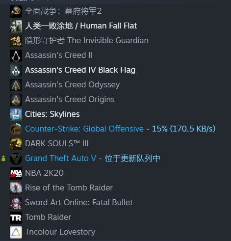

# 2020没有牛逼闪闪，但也不至于惨不忍睹
> 20201231写于1037号森林
> 江易星

今天是2020年的最后一天，照常理也该回顾回顾过去的这一年，经历了什么，顺便也展望一下明年。

去年今天，本科班上的最后一次班聚，大家在桌上聊着“华南海鲜市场”的事情，完全没有想到这只是接下来半年及其严重的疫情的开头。   

本来打算在武汉过完年再回来家待几天的，结果武汉封城、湖北封省。尤其是最开始的时候，看着每天1000多的确诊人数，整个人都笼罩在一种恐惧的阴影之中。一方面是整天和爸妈闭塞在家里，每天走的最远的距离就是从卧室到饭厅和从卧室到厕所。另一面是看了两三个月仍然没有什么进展的毕业论文，一度觉得自己自己的毕业论文写不出来了，毕不了业了。    
这段最为艰难的日子里，最开始是把剩了一点的《明朝那些事儿》看完了。然后看完了特别火的《鬼灭之刃》。《鬼灭之刃》的确是一部非常优秀的番剧，也成了我2020少数看完的几部番。这段时间内给了我很多温暖和感动的，是电视剧《请回答1988》和木鱼水心的解说。我以前对韩剧是有偏见的，当时这部剧真的是带给了我非常多的感动。

没有实验设备，就自己在家搭，自己在家调。最后时间差不多刚刚好完成了毕业论文，虽然答辩的时候非常糟糕，被老师各种怼，分数也差得令人发指，但是好歹是毕业了。那段在家写论文的时间里，多亏了娜娜姐的语文课，我是没想到，自己在高中毕业四年后，还有机会回去上娜娜姐的语文课，娜娜姐的语文课，在我因为写论文而头大的时候，给了我很多调剂。

终于可以返校了，分批返校的形式注定没法和很多人见面了，大学一起四年的室友也没法4人聚集了，好在我和老司机都不算远，分了两次的3人聚，总算是都见到了。毕业照也拍得零零散散，凑不齐很多人，五六个人一起拍也很满足了，还拉了vince cooper来给我们当摄影师。班长和很多人一起筹划了我们的毕业纪念品，我们班独有的毕业书、钥匙扣、毕业衫、手环、帽子......

本科生活结束了，研究生生活又是一个新的开始

认识了很多新的人，很多很多。这些人里有很好的室友，有新来的师弟，有同级的同学等等。11月以来的这两个月的时间，算是今年度过的，非常开心的一段时光了，很感谢给我带来过快乐的人。知道了法外狂徒罗翔老师，在他的段子中学到了一些法律知识，看过了罗老师的《圆圈正义》，对罗老师真的很佩服。

经历了人生第一次智齿发炎。发炎到我连嘴都不能张，喝水都不能喝，左边发完炎右边又开始，导致我那半个月都没有好好吃过饭。于是有了去拔智齿的经历，前天刚去拔了第二颗。

总的来说，目前的研究生生活比之前的本科生活要美好一些。比较开心的是，每个月有工资了，不再像本科的时候那么贫穷了。有了钱我就可以做很多自己想做的事情了。给自己换了手机。买了很多早就想买的游戏：Minecraft、刺客信条起源、刺客信条奥德赛、黑魂3。Minecraft是当作自己今年的生日礼物买给自己的，以前本科的时候就像买了，但是一直没有钱。毕竟它要170。以前买一百左右的游戏，我都会犹豫很久，现在有工资了，一两百的游戏眼睛都不眨就买了。虽然99%的游戏都躺在游戏库里面吃灰。

今年自己对自己是很好的了，去报名学吉他了。虽然我的手比较小，可能会稍微难一点，但我要一定要把吉他学下来，我要自己给自己弹喜欢的曲子。虽然目前才刚刚起步，和弦都不太能按得住。

明年又是一新的一年了，最想的事情就是把吉他学会，然后要把智齿全都给拔了。这两件事情在下个学期之内应该可以完成。 至于其他的事情，暂时还没想好。但是不管怎么样，希望明年继续努力，好好工作。

希望疫情快点过去吧，《鬼灭之刃 无限列车》和《紫罗兰》的剧场版能快点上映。如果能够再重拾一点对动漫的热爱就好了，2020年真的感觉对动漫的喜欢有很大的消退。

最后有感而发吧：

我很庆幸我始终有很多好朋友，当我觉得不开心的时候，我可以找他们倾诉，可以找他们吐槽。虽然我们可能相距很远，但我知道我需要他们的时候，他们不会置我于不顾。即使是要加班，老司机也会出来陪我吃饭，丑狗和涂俊也会倾听我的烦恼，然后开导我。

我时常觉得，高中时候的自己真的好优秀啊，我现在回想起来都觉得那时候的自己浑身都在闪着光啊，知道自己喜欢谁，知道自己能去哪，也没有什么烦恼、朝着目标拼了命的努力。
现在好像时常会觉得有点迷茫。但人还是应该往前看，谁知道明年又会发生什么呢？
