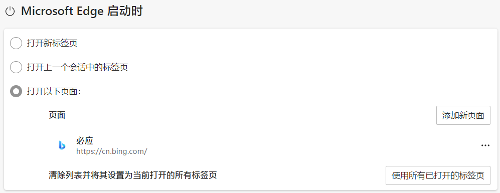
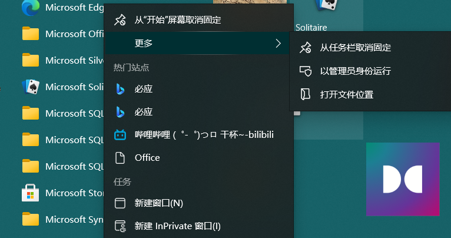
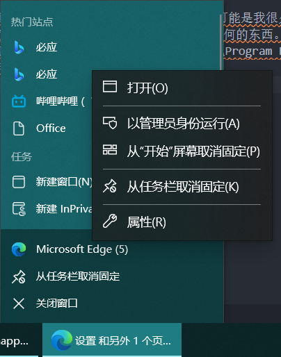
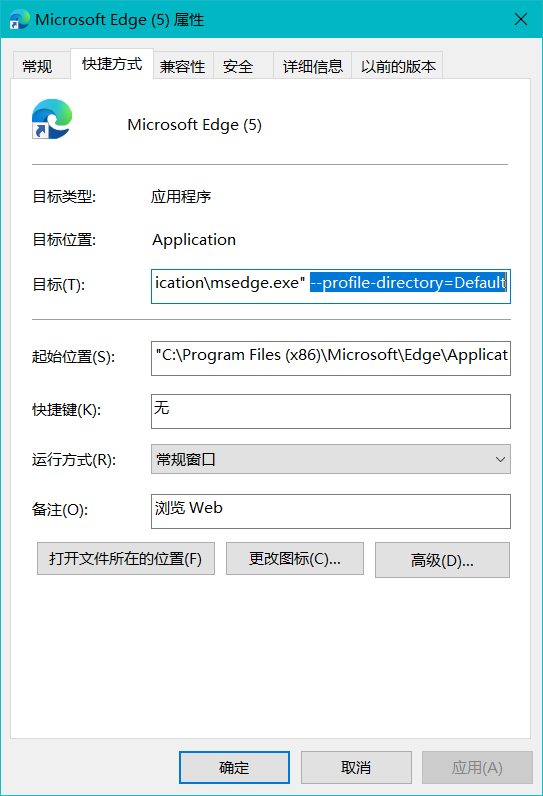
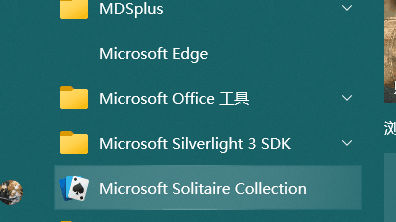
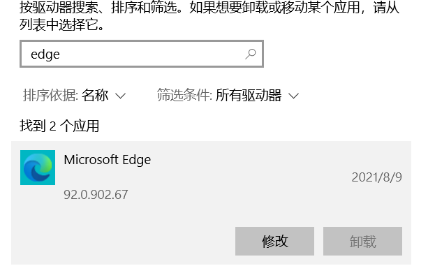

# 20210809Edge启动页被360首页劫持的处理

## 问题起因
chrome谜之卡顿，吃内存是时常的事情，在[老司机](https://github.com/Macyrate)的建议下，我决定去试一下新版的edge，反正老早edge就已经换成了Chromium内核的了。
于是在我进行了一系列设置之后，把edge整成了舒服的样子。然后设置了一个启动页

图1：设置启动页

然后当我重新启动edge的时候，结果出现的却是360的首页。于是我尝试了重启edge，重启系统，以及清楚edge的缓存等等，发现都不行。

## 解决经过
1. 查到说由于**杀毒软件的锁定造成的**，要在杀毒软件中解决锁定，可能是我很久之前用过360的动导致，但是早就已经删除的干干净净，根本不存在360任何的东西。但我还是删除了所有和360有关的东西 包括在 C:\Program Files 和C:\Program Files(x86)下的东西。发现不起作用。
2. 查到可以**修改Edge设置中的目标**。但是开始菜单中的没有进入edge设置的方法

找了半天发现把edge固定到任务栏，然后右键可以打开属性

进去属性之后**常规 -> 只读**取消选中，然后**快捷方式->目标** 最后部分修改为 下图选中部分，或者这部分删除掉

图2：修改为选中部分

修改这个的时候遇到了需要管理员权限，然后无法修改lnk的问题，没有修改成功。
3. 查到说这个是因为是在快捷方式中固定了启动的页面，所以最简单的解决方案就是删除掉快捷方式然后重新创建一个，但是我这个快捷方式是在开始菜单中的快捷方式，任务栏中的也是通过开始菜单中的过去的，所以我就需要删除掉开始菜单中的，然后重新在开始菜单中建立一个。
首先在C:\ProgramData\Microsoft\Windows\Start Menu\Programs。这个文件夹下保存的就是开始菜单下的内容，在这里面删除掉edge。
然后发现开始菜单中的edge还存在，但是没有图标了，固定到任务栏也是那个位置可以点，打开也是正常的，但是就是没有图标，是个虚空的

图3:没有图标

4. 最后重启了一下电脑还是没有，于是试着重装了一次edge，在设置->所有应用中，选中edge之后修改，系统就会自动重装一次edge，然后就好了

图4:重装edge

