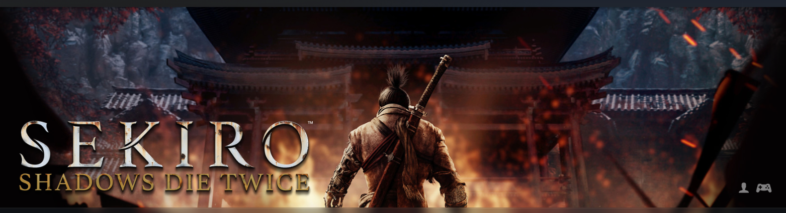
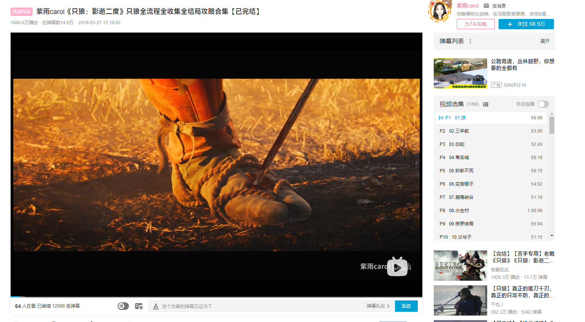

# Sekiro Shadow Die Twice 条狗 秒死两次

只狼这个游戏我终于在11月来临之前通关了，全结局。     

提到只狼，首先就不得不说它的游戏难度。只狼究竟难还是不难呢，我甚至无法给出一个比较准确的答案。如果我说它不难的话，那只能说是好了伤疤忘了疼，在打游戏的时候被各种精英怪、各种boss疯狂教育，心态爆炸、疯狂骂宫崎英高的娘，捶桌子这些都是经常的事情，一个boss打几十上百遍，打五六个小时才过也是家常便饭。但要是说难呢，只狼一不需要反应速度，二没有复杂的操作难度，三是所有的精英以及boss的招数都不多，应对方法也及其简单，四是像我这种游戏水平在一般玩家中也只能算菜鸡的玩家甚至能在一个伤药葫芦也不吃，一个加buff的糖也不用的情况下，几乎纯硬拼刀通关。实在不能让我觉得这个游戏有多大的难度。

或许这就是魂系游戏的特点，初见的难度会觉得大，但是熟悉之后整个游戏的难度会大大下降。在我打完整个游戏之后，我想来只狼整个游戏，唯一的难度在于节奏。你只需要掌握boss出招的节奏，就能很好的做到完美弹反。比如苇名弦一郎有一个后撤步射箭的招，节奏就是3+1，三下快，然后略微停顿之后再接一箭。我觉得我能完整的打完这个游戏可能得益于我并不是毫无节奏感。

   
后撤步射箭:3+1

打boss的时候你能明显感觉到自己在不断被虐的过程中逐渐变强，最开始可能第一条黄条都攒不满，被几下就秒了，然后慢慢的和boss有来有回，然后发现可以打过第一阶段了，然后第二阶段有来有回，第一阶段变得随便过，然后第二阶段也变得熟悉起来，然后就离通过不远了。在一次次挨打的过程中，boss的所有招数以及你该如何应对，这些都会一步步刻进你的血肉里去。你自己都能感觉到自己在变强。

非常感谢[紫雨](https://space.bilibili.com/9064879?from=search&seid=9440999690391880798&spm_id_from=333.337.0.0)的攻略，省去了我开荒、探图，规划路线以及打法的时间，如果没有这些，打过这个游戏要花的时间恐怕要多很多。

因为紫雨攻略的原因，我打这个游戏几乎没有用过葫芦、各种糖。只在很少的几个地方用了，比如打狮子猿用一个阿攻，源之宫用月隐之类的，其他地方葫芦也不用，糖也不用，死了就重来。 

我打这个游戏最难的部分应该是刚开始的那约20个小时，刚开始的时候我甚至估计我可能需要200小时才能通关。但是这个游戏主要的难度就在前期，尤其是对于我这种第一次接触魂系游戏的人，最开始需要花一定的时间去熟悉去适应这个游戏的玩法，适应了之后就顺手起来了。

我的游戏大概分为三个阶段，第一阶段是前20个小时，这一部分以三重塔雾里鸦羽毛处的孤影众为终点，我花了大概10个小时的时间去打这个孤影众，在此之前从一个鬼佛打到下一个照着攻略大概都要打几十遍。之后基本上五遍以内，那道从河流上到三重塔的小路我不知道爬过多少遍了。

第二个阶段到打过弦一郎。其实打弦一郎没有费多大劲。两个小时都没到我就已经熟悉他所有的招式，并且都知道该怎么打了，但是想一条血打过去还是有点难度。以致于我打到第6个小时才打过，除了反雷扣血其他没被打一下过的，但是当时没有录屏，我想了想觉得好亏，于是想打一个无伤出来，于是又打了整整二十个小时都没打出来，总是会出现那么一两个失误，打完弦一郎都80小时了。之后就是第三阶段了，在打了很长时间的弦一郎之后，整个游戏陡然变得及其简单了，后面的boss就三年前义父花了4个小时，其他的都是很容易就过了，很多boss都是还没有熟悉他的招式就莫名其妙打过了。

整个游戏中出现的所有人物，想来除了义父，没有一个算得上是真正意义上的坏人，只是各自的信仰立场不同罢了。囚禁卿子，身为武士却偷袭只狼，从而砍掉了只狼左手的"武士之耻" 苇名屑一郎，。同时也是一心只为延续苇名血脉，不惜借用龙胤之力，利用不死斩从黄泉换回壮年剑圣的“苇名之梁”。

武士之耻 来骗来偷袭

苇名之梁

老年的苇名一心，算是整个剧情中最为通透的人了。他明白，苇名这个国家的命运，就和他一样，已经是风中残烛。所以他并不追求卿子龙胤来延续苇名的生命，也不追求使用龙胤让自己死而复生，反而想着帮助卿子逃离苇名。“犹豫，就会败北”可以说是他这一辈子征战的经验总结，剑圣之名当之无愧。   

犹豫就会败北

义父就是这个游戏里面最屑的人，三年前，勾结盗贼，图谋杀害平田主人，利用只狼杀掉曾经和自己一起参加盗国之战的战友蝴蝶夫人，还从背后捅只狼刀子，父慈子孝，折走常樱之花导致之后常樱枯萎。三年后，意图控制卿子、获得龙胤之力，还给只狼定下父母大于一切以及主人丢失务必救回的忍者戒律，只是为了得到龙胤之力。所以无论最后走向的是哪个结局，都由只狼亲手解决掉了义父。出身低但是却不想着为善，只想着利用计谋使自己名扬日本，甚至连自己昔日并肩作战的战友蝴蝶夫人、一心等都不放过。

父慈子孝

虽然打通了，但是有些boss都没有打熟练，应该不会再打第二遍了。大概率是没有时间去打第二遍了，我能坚持打完这个游戏，还坚持几乎不用药、不用糖、不用复活，与我这种手残的游戏玩家来说，已经是非常开心了。虽然我对这个游戏还有诸多不适应，控制不了自己砍几刀，也还不适应那种出招就不能中途收回的设定，使得我经常在战斗中出招被砍，弹反也做不到纯净，还在用抖刀啦弹反，也没能打出无伤等等。如果需要纠正这些不好的习惯需要一定的时间，可能也不会去纠正了。

这个游戏真的非常推荐给手残的玩家，尤其是那些游戏水平不怎么样的，打游戏一阵乱按，乱莽的，甚至完全没有打过游戏的玩家。真正打完这个游戏会觉得买这个游戏的钱以及打这个游戏所花费的一切时间，受的一切苦都是值得的。
